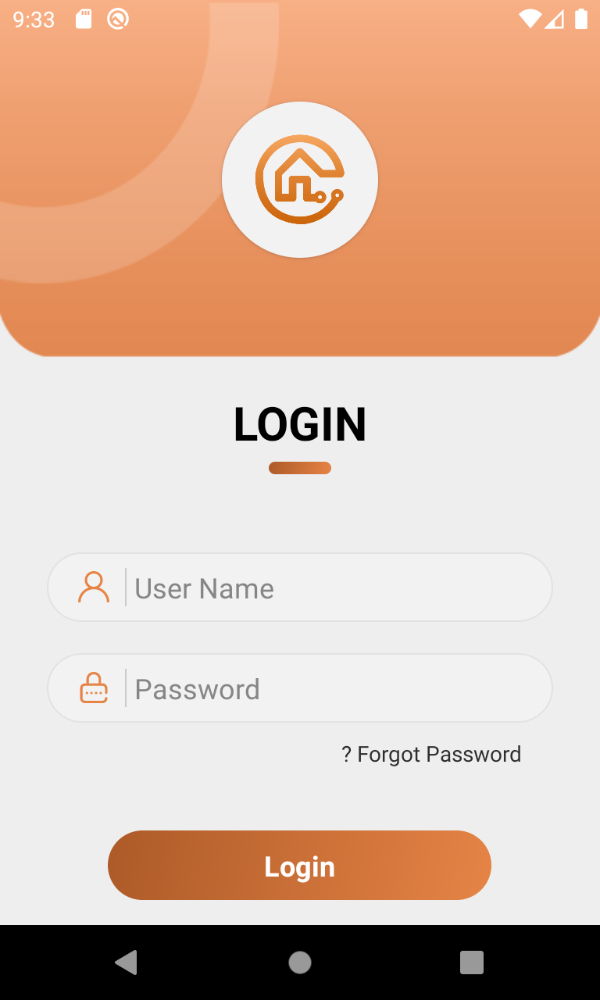
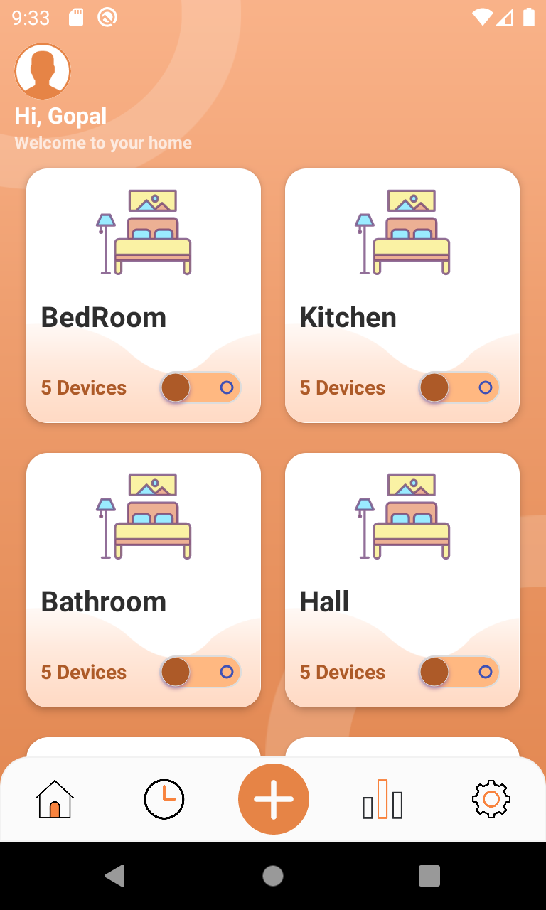
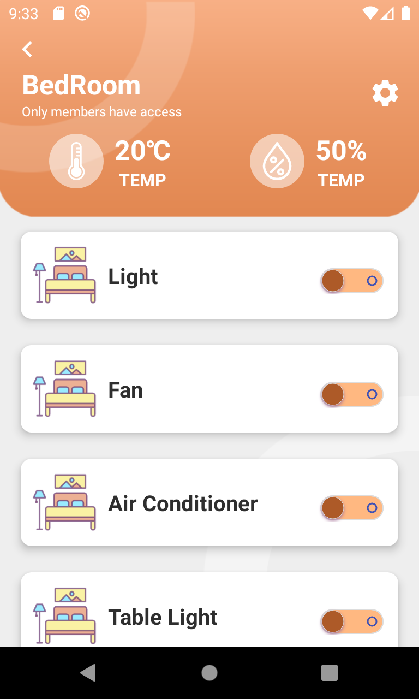

# SmartHome
Android design for smartHome

Smart Home application enables users to easily connect with various home appliances, including Lightings, air conditioner, music systems and more through your smartphones.

It also contains 18 fully layered and editable, high resolution screens.

Slick and modern looking eye soothing app provides one place smart home solution where everything is in a tap away.

